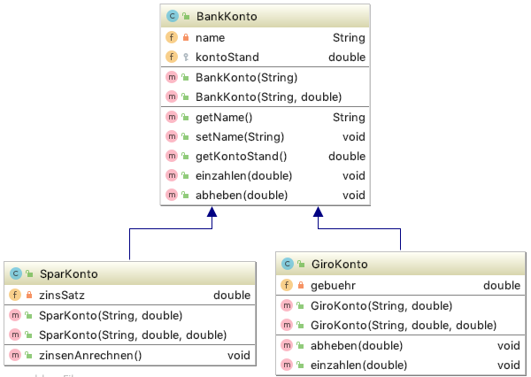

# Übung Bank

Lehrziele:

- Objektorientierung / Vererbung
- Lesen und Schreiben von Dateien

## Aufgabenstellung

Erstellen Sie zunächst folgende Klassen im Package `at.htl.bank.model`. 



### Klasse BankKonto

Beim Konstruktor werden entweder `name` und `anfangsBestand` übergeben oder nur der `name`. Wird kein Anfangsbestand übergeben, so ist der Kontostand 0.

Die Methoden `einzahlen(double betrag)` und `auszahlen(double betrag)` erhöhen oder vermindern den Kontostand um den angegebenen Betrag.

### Klasse Sparkonto

Bei der Klasse Sparkonto wird das Geld verzinst (in der Methode `zinsenAnrechnen`).  Der `zinsSatz` wird in Prozent angegeben.

Konstruktoren:

```
public SparKonto(String name, double zinsSatz)
public SparKonto(String name, double anfangsBestand, double zinsSatz)
```

### Klasse GiroKonto

Bei einem Girokonto muss man für jede Ein- oder Auszahlung eine Gebühr entrichten (in unserem Beispiel werden immer 2 eurocent abgezogen), dh die Methoden `einzahlen()` und `auszahlen()` sind zu überschreiben.

Konstruktoren:

```
public GiroKonto(String name, double gebuehr)
public GiroKonto(String name, double anfangsBestand, double gebuehr)
```

### Klasse Main

Die Klasse Main ist mit Ihren Methoden vorgegeben. Die einzelnen MEthoden sind zu implementieren. Beachten Sie die Kommentare in der Klasse Main.


VIEL ERFOLG !!!